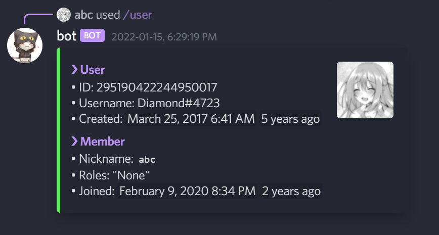
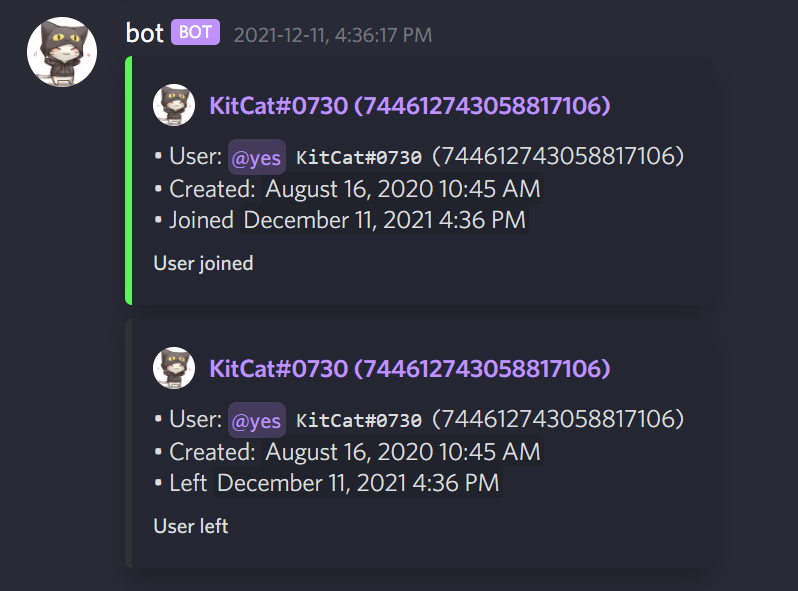
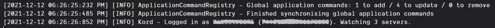

# kord-boilerplate 

A modular boilerplate discord bot with [Kord](https://github.com/kordlib/kord)
and [Kord Extensions](https://github.com/Kord-Extensions/kord-extensions) \
This contains all the most common commands/functionalities people usually want.

Feel free to build upon and sell if you want to, but *please please please* contribute if you write anything useful.

## Features (Still WIP)
If you want something to be added, please open an issue
here [here](https://github.com/DiamondMiner88/kord-boilerplate/issues)

- .env Config
- [Exposed](https://github.com/JetBrains/Exposed) SQL framework integration (soon)
- Button roles (soon)
- Reaction roles (soon)

### Ban/Kick

### User lookup

### Member log

### Purge

### Echo

### Configured logger

